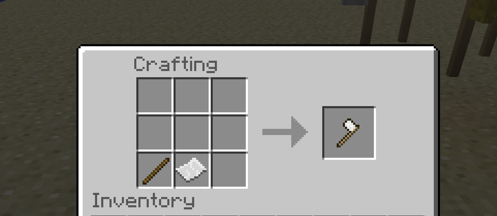
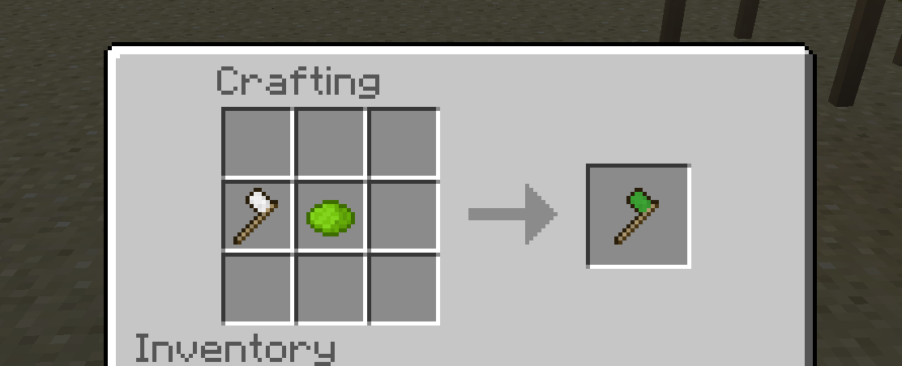
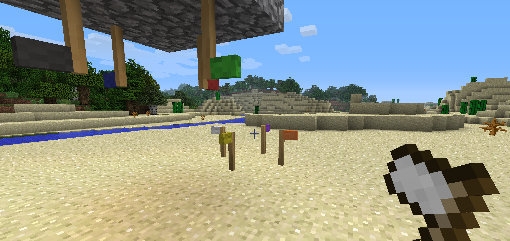
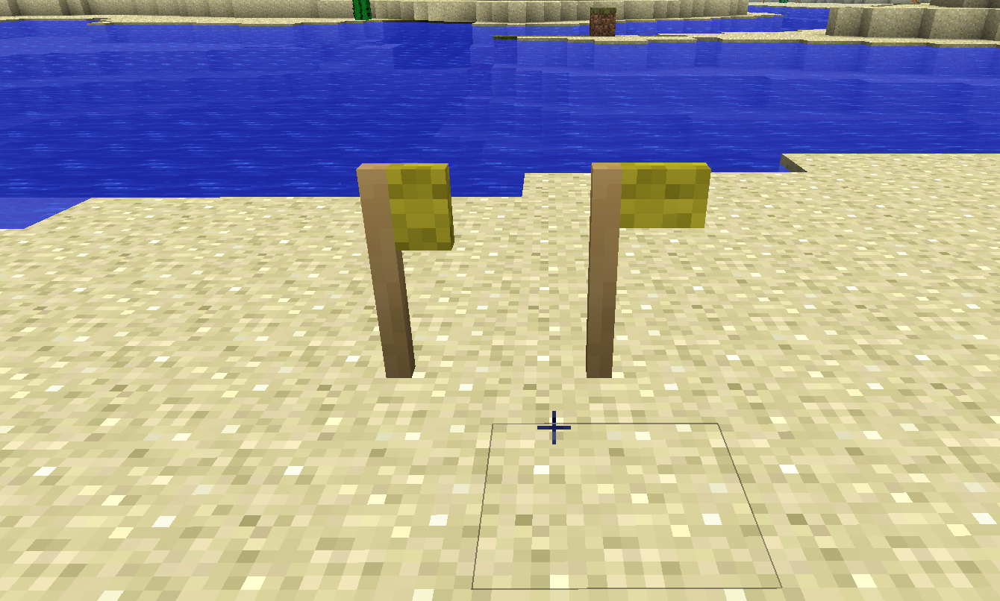
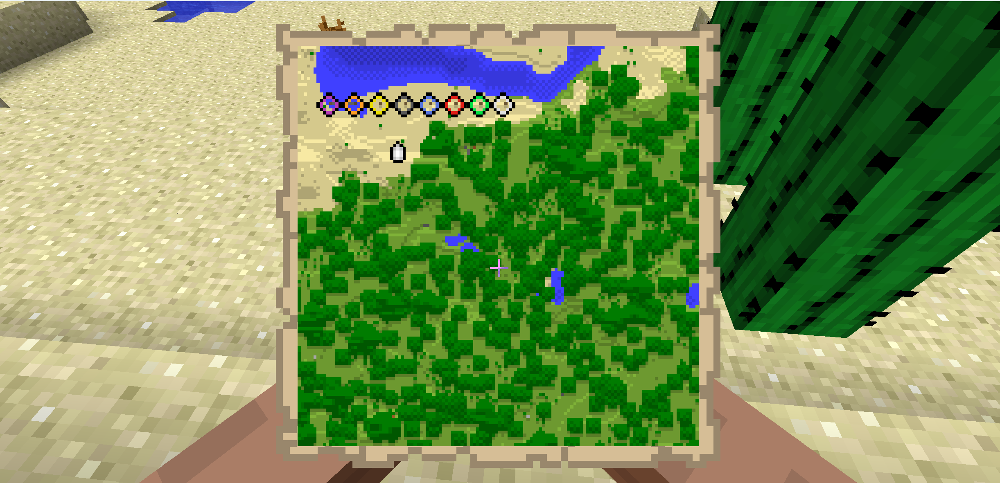

# BTW Map Markers
Adds Map Marker flags that can be placed anywhere in the overworld to add colored markers to in game maps. Or placed anywhere for decoration.

The recipe is shapeless consisting of paper and either a stick(shaft) or any type of wood moulding. Dye can be applied to any flag to change colors. In a cauldron, 16 flags can be dyed with a single dye for added efficiency.

The 8 supported colors are 
white (default), lime green, red, blue, gray, yellow, orange, and purple.

When placed, the flag will be in a deactivated state and require you to activate using an appropriate map for the area where the flag has been placed. (left is deactivated, right is activated)

The flag colors correspond with the markers on the map.

